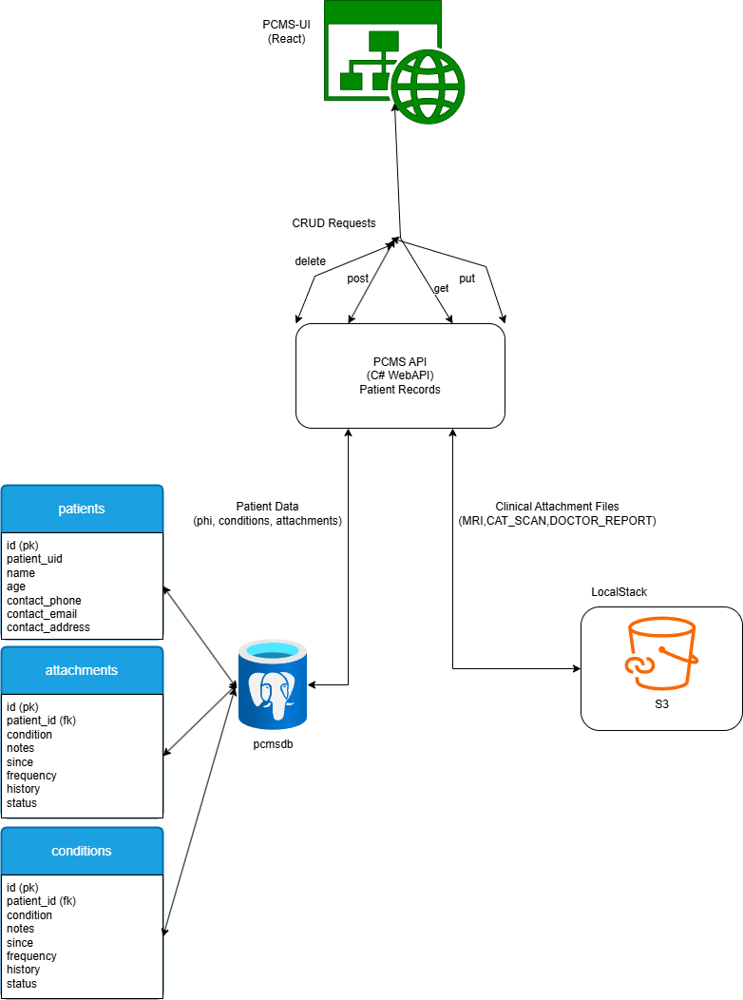

# 🩺 Patient Clinical Management System (PCMS)

PCMS is an all in one system for managing patient records and their clinical attachments (e.g., MRI Scans, CAT Scans, Doctor Reports).  
It consists of a Modern React UI, .NET 9 Minimal API backend, and LocalStack for local AWS S3 emulation.

---

## 🖼️ Architecture

The following diagram outlines the high-level architecture



---

## 📁 Project Structure

```
PCMSApi/        # .NET 9 Minimal API for managing patients
pcms-ui/        # React frontend for interacting with the API
docker-compose.yml
Makefile        # Bash commands for starting local development stack and uploading scans
run.ps1         # Powershell commands for starting local development stack and uploading scans
```

---

## 🧪 Features

### ✅ WebAPI (.NET 9 Minimal API)
- Used .NET 9 Minimal API for performance, simplicity, and clarity
- The API supports full CRUD operations on patient records
- Allows users to upload and manage clinical attachments (MRI, CAT Scan, Doctor Reports)
- Stores metadata in Postgres and files in S3-compatible storage (LocalStack)
- JWT-based static token authentication for development use

### ✅ React UI (`pcms-ui`)
- Responsive, UI allowing the user's full Create, Read, Update, Delete support for patient data
- Upload multiple files with associated document types via dropdown
- Search/filter patients by name, condition, or document type
- User authentication with login/logout buttons

### ✅ LocalStack (Simulated AWS)
- Using to emulate AWS S3 locally
- **Why LocalStack?** Using LocalStack is better than managing files in mounted volumes because:
  - Mimics production-like S3 behavior (folder structure, presigned URLs, etc.)
  - Enables testing lifecycle events and security boundaries without touching real cloud resources
  - Great for team workflows, CI/CD, and integration tests

### ✅ PostgreSQL (Database)
- Stores structured patient data including medical history and attachment metadata
- Efficiently handles relational data models with foreign keys (e.g., one patient → many attachments or conditions)
- **Why PostgreSQL?**
  - Chosen over SQLite for its full-featured relational capabilities, concurrent access support, and robust transaction handling
  - Scales easily with future needs like audit logging, advanced querying, and indexing
  - Supported natively in cloud and containerized environments, making it a great choice for local development
---

## 🛠️ How to Run 

### 🍎 MacOS Bash

### 🔄 Run Backend + Frontend + LocalStack

```bash
make run
```

- Spins up LocalStack, Postgres Database, C# .NET 9 Minimal API, and a React UI using `docker-compose`

---

### 📂 Upload Fake Scan Files to S3

```bash
make init-s3
```

- Creates the `medical-files` bucket and uploads sample files into appropriate folders under patient UIDs and attachment UIDs

### 🪟 Windows (PowerShell)

```powershell
.\run.ps1 -Command run
```

- Spins up LocalStack, Postgres Database, C# .NET 9 Minimal API, and a React UI using `docker-compose`

```powershell
.\run.ps1 -Command init-s3
```
- Creates the `medical-files` bucket and uploads sample files into appropriate folders under patient UIDs and attachment UIDs

---

## 🔐 Authentication

- When you press **Login** in the UI, it fetches a static dev token from `/auth/dev-token`
- This token is stored in `localStorage` and attached to all future requests
- Logout clears the token and disables access

---

## 📦 Dependencies

- [.NET 9 SDK](https://dotnet.microsoft.com/en-us/download)
- [Node.js & npm](https://nodejs.org/) (for `pcms-ui`)
- [Docker & Docker Compose](https://www.docker.com/)
- [Make](https://formulae.brew.sh/formula/make) (included by default on macOS)

---

## 📥 API Endpoints

| Method | Endpoint                                    | Description                                               |
|--------|---------------------------------------------|-----------------------------------------------------------|
| GET    | `/patients`                                 | List patients (paginated)                                 |
| POST   | `/patients`                                 | Create patient (can include attachments)                  |
| PUT    | `/patients/{id}`                            | Update patient (can include attachments)                  |
| DELETE | `/patients/{id}`                            | Delete patient and all attachments                        |
| DELETE | `/patients/{id}/attachments/{attachmentId}` | Delete a specific attachment                              |
| GET    | `/auth/dev-token`                           | Get a static development token (Local Only)               |
